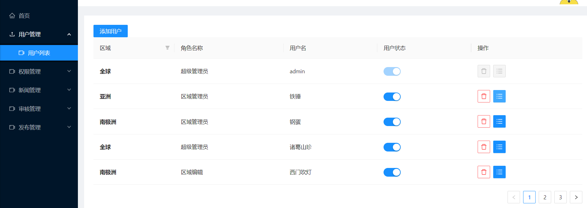

# 新闻后台管理

#### 介绍

一套简洁的后台管理系统

#### 项目源码

| 码云 | https://gitee.com/tianxiaodao/news-background-management.git |
|----|--------------------------------------------------------------|


#### 体验地址

暂无

#### 使用说明


```
# 安装依赖
npm install

# 启动json-server
npm run json-server

# 启动服务 
npm run start

# 构建生产环境
npm run build
```


#### 技术栈
1. react 18.x
2. react-roter-dom 5.x
3. react-dom
1. ant
1. axios
1. react-redux 8.x

#### 预览
`超管：admin 123456`





